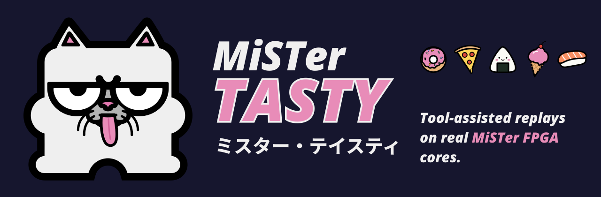
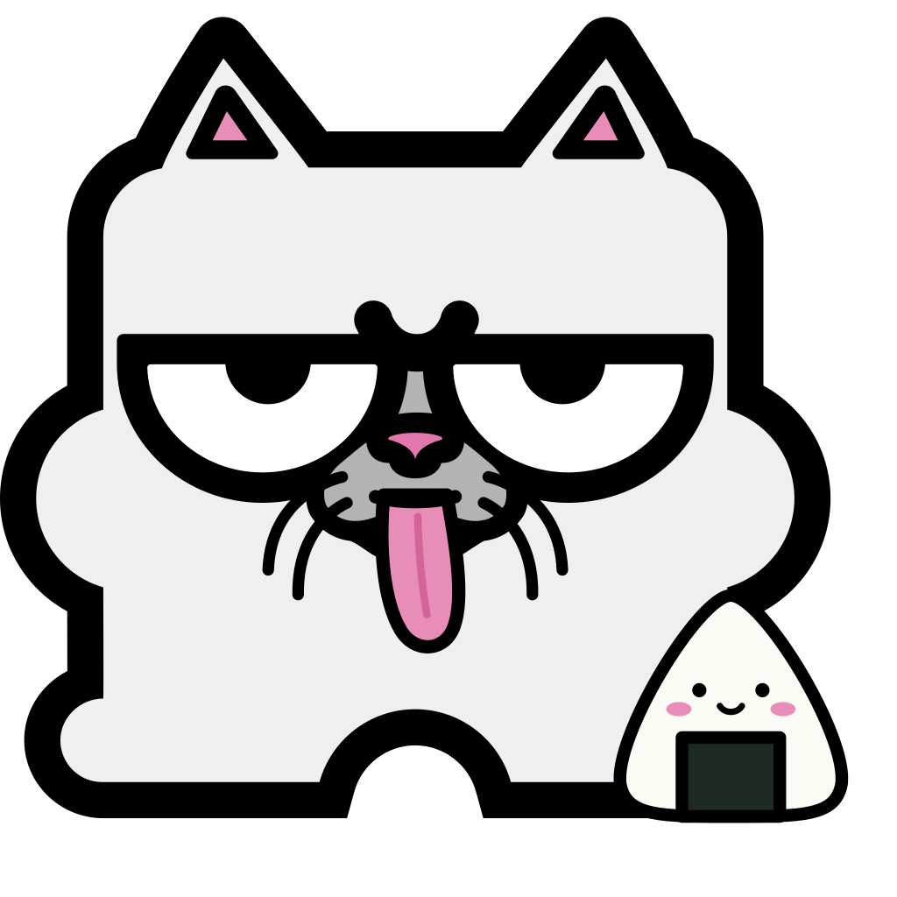

<p align="center"></p>

# MiSTer Tasty

**Tool-assisted replays on real MiSTer FPGA cores.**

MiSTer Tasty plays published TAS movies back on a MiSTer, right from the DE10-Nano's own ARM side, with no replay
bot on the controller port and no extra hardware. Each input is fed to the core on the frame the movie asks for.
Watch a run play out on the real gateware, or use it to check a core's timing against the emulator it was
recorded on.

The command-line tool is `tasty`.

> **Status:** early and hungry. The first release: NES runs play frame-exact on a DE10-Nano; other systems are experimental.

##  Try it

**Quick start.** On the MiSTer (SSH in as `root`), with your own Super Mario Bros. ROM somewhere under
`/media/fat/games/NES`:

```sh
ssh root@<your-mister>
curl -fsSL https://raw.githubusercontent.com/mcfbytes/Tasty_MiSTer/main/test-tasty.sh | sh
```

[`test-tasty.sh`](test-tasty.sh) is short; read it before you pipe it to a shell. It never downloads a ROM: it finds
your copy, checks its checksum, and only then downloads `tasty` and the movie into `/media/fat/tasty`.

It takes three steps and one command. The binary is on the [releases page](https://github.com/mcfbytes/Tasty_MiSTer/releases/latest).

 Get `tasty` onto the SD card:

```sh
mkdir -p /media/fat/tasty && cd /media/fat/tasty
curl -fLO https://github.com/mcfbytes/Tasty_MiSTer/releases/latest/download/tasty && chmod +x tasty
```

 Get a movie, here klmz's Super Mario Bros. run from
TASVideos. You also need your own dump of the game; the file names below are the No-Intro ones.

```sh
curl -fL -o 1330M.zip 'https://tasvideos.org/1330M?handler=Download' && unzip -o 1330M.zip
```

 Play it:

```sh
./tasty play klmz3-smb.fm2 --rom "/media/fat/games/NES/Super Mario Bros. (World).nes"
```

**What you'll see:** the MiSTer menu goes away (`tasty` needs the FPGA to itself, so it stops the running MiSTer
binary), a short Tasty Kun splash, then the NES core boots and Mario runs the game in just under five minutes. If
your NES core settings differ from the movie's, `tasty` prints each one it uses for this run, such as
`RAM Clear: using $00 for this run (your setting: No)`; your saved settings are not touched. 30 seconds after the
last input it restarts `/media/fat/MiSTer` and you are back at the menu. `--linger <seconds>` changes that wait,
`--stay` keeps the core running, and `tasty stop` ends early. A dropped SSH session no longer stops a run;
`tasty stop` or Ctrl-C ends it and returns to the menu. `--no-splash` skips the logo. Your saves are left
alone too: on the NES, SNES and Genesis the game powers on with no save loaded, as the movie expects, and the file
in `saves/` is never opened.

**Known-good runs** (played to the end, in sync, on a DE10-Nano with the stock cores). The last column is
anything beyond `tasty play <movie> --rom <file>` the run needed; "none" means the defaults just work:

| system | game | movie | length | ROM (No-Intro) | needed |
|---|---|---|---|---|---|
| NES | Super Mario Bros. | ["warps" by klmz](https://tasvideos.org/1330M) | 4:57 | `Super Mario Bros. (World).nes` | none |
| NES | Super Mario Bros. | ["warps" by HappyLee](https://tasvideos.org/1715M) | 4:57 | `Super Mario Bros. (World).nes` | none |
| NES | Mike Tyson's Punch-Out!! | [by adelikat](https://tasvideos.org/1695M) | 17:47 | `Mike Tyson's Punch-Out!! (Japan, USA) (En) (Rev 1).nes` | none |
| NES | Tetris | ["playaround" by Baxter](https://tasvideos.org/1502M) | 2:17 | `Tetris (USA).nes` | none |
| NES | Tetris | ["maximum score" by r57shell & Archanfel](https://tasvideos.org/4853M) | 2:53 | `Tetris (USA).nes` | none; 999999 lands just after the last input, so add `--stay` to see it |
| NES | Castlevania | [by Challenger & eien86](https://tasvideos.org/4840M) | 10:12 | `Castlevania (USA).nes` | none |
| NES | Zelda II: The Adventure of Link | ["warp glitch" by TASeditor, Arc, Inzult & EZGames69](https://tasvideos.org/4234M) | 5:32 | `Zelda II - The Adventure of Link (USA).nes` | none; `--stay` to watch the ending and credits |
| NES | Ghosts'n Goblins | [by DreamYao](https://tasvideos.org/4469M) | 8:04 | `Ghosts'n Goblins (USA).nes` | none; `--stay` to watch the ending |
| NES | Galaga: Demons of Death | [by eien86](https://tasvideos.org/5557M) | 8:17 | `Galaga - Demons of Death (USA).nes` | none |
| NES | Mighty Final Fight | [by Xipo](https://tasvideos.org/3538M) | 8:06 | `Mighty Final Fight (USA).nes` | none |
| NES | Rush'n Attack | ["1 player" by peco_de_guile & aiqiyou](https://tasvideos.org/4884M) | 9:39 | `Rush'n Attack (USA).nes` | none; `--stay` to watch the ending and credits |
| NES | Star Wars: The Empire Strikes Back | [by link_7777](https://tasvideos.org/6397M) | 10:42 | `Star Wars - The Empire Strikes Back (USA).nes` | none |
| NES | Pac-Man (Tengen) | [by eien86](https://tasvideos.org/5231M) | 12:02 | `Pac-Man (USA) (Tengen).nes` | none |
| SNES | Super Punch-Out!! | [by adelikat](https://tasvideos.org/4933M) | 15:52 | `Super Punch-Out!! (USA).sfc` | none |
| SNES | Super Mario All-Stars: Super Mario Bros. | [by Niftski & HappyLee](https://tasvideos.org/6744M) | 5:03 | `Super Mario Collection (Japan).sfc` | `--lead -1` |
| SNES | Contra III: The Alien Wars | ["2 players" by Mr_K & EZGames69](https://tasvideos.org/4363M) | 12:37 | `Contra III - The Alien Wars (USA).sfc` | none; `--stay` to watch the ending |

**Probably good:** Mike Tyson's Punch-Out!! [4226M by McHazard](https://tasvideos.org/4226M) (BizHawk, `Mike Tyson's
Punch-Out!! (Japan, USA) (En) (Rev 1).nes`, no options). Tyson is going down on the last frame; the count was not recorded.

**Candidates, not yet played to the end.** Each stayed in sync for its first 60 seconds and was stopped there, so it
may still desync later; a report either way is welcome. The SNES ones were checked on a test build of the SNES core
that starts from the emulator's power-on RAM (see below), and are untested on the stock core.

| system | game | movie | length | ROM (No-Intro) | needed |
|---|---|---|---|---|---|
| NES | Prince of Persia | [by eien86](https://tasvideos.org/4651M) | 15:20 | `Prince of Persia (USA).nes` | none |
| NES | Adventure Island 3 | [by J.Y](https://tasvideos.org/4462M) | 18:20 | `Adventure Island 3 (USA).nes` | none |
| NES | Mega Man 2 | [by Shinryuu](https://tasvideos.org/4410M) | 23:39 | `Rockman 2 - Dr. Wily no Nazo (Japan).nes` | none |
| NES | Mega Man 3 | [by Pike & Tiancaiwhr](https://tasvideos.org/2439M) | 30:21 | `Rockman 3 - Dr. Wily no Saigo! (Japan).nes` | none |
| SNES | Super Star Wars | [by Exonym](https://tasvideos.org/2722M) | 18:36 | `Super Star Wars (USA).sfc` | `--lead -1` |
| SNES | The Magical Quest Starring Mickey Mouse | [by Tompa](https://tasvideos.org/4486M) | 14:47 | `Magical Quest Starring Mickey Mouse, The (USA).sfc` | none |
| SNES | Disney's Aladdin | ["capeless" by jaysmad](https://tasvideos.org/3375M) | 16:37 | `Aladdin (USA).sfc` | none |
| SNES | The Lion King | [by EZGames69, SBDWolf, Akiteru & ShgofcTAS](https://tasvideos.org/6987M) | 10:50 | `Lion King, The (USA).sfc` | none |
| SNES | Super Metroid | [by Sniq](https://tasvideos.org/3653M) | 35:58 | `Super Metroid (Japan, USA) (En,Ja).sfc` | none |

**About `--lead`.** tasty picks a default for each movie format (FCEUX `.fm2` -3, BizHawk NES -2, BizHawk SNES -2
for its older `BSNES` core and -1 for `BSNESv115+`). On the SNES the right value varies from movie to movie: Super
Mario All-Stars needs `-1`, Super Punch-Out!! and Contra III need the default, and Rockman X
[6658M](https://tasvideos.org/6658M) (`BSNESv115+`) needs `-2`. If a SNES movie goes wrong in its first minute (Start
never takes, or the attract demo plays), try `-1` and `-2` before giving up on it.

**Known to desync.** A TAS is tuned to the frame its emulator accepted each input on, so wherever that emulator's
timing differs from the hardware, a faithful core goes its own way; console-verified movies are the best bet. These
run in sync for a long stretch first:
- Super Mario Bros. 3, ["warps" by Lord_Tom, Maru & Tompa](https://tasvideos.org/3922M) (console-verified): about
  nine minutes, then one frame behind during World 8's tank fight.
- Super Mario All-Stars: The Lost Levels, ["warpless, Mario" by HappyLee](https://tasvideos.org/3456M)
  (console-verified, `--lead -1`): Worlds 1 to 5, about 14 minutes, then goes wrong in World 6.
- Mega Man X, [3151M](https://tasvideos.org/3151M), ["100%" 3197M](https://tasvideos.org/3197M) and Rockman X
  ["X-Buster only" 6658M](https://tasvideos.org/6658M): the intro and Chill Penguin in sync, then all three go wrong just
  after that boss, identically with and without the emulator's power-on RAM.

`tasty check` confirms your ROM matches a movie before you start.

##  What it plays

| system | core | movie formats | status |
|---|---|---|---|
| NES | NES | `.fm2` (FCEUX), `.bk2` (BizHawk NesHawk) | **works**: see the known-good runs below |
| SNES | SNES | `.lsmv` (lsnes), `.bk2` (BizHawk) | **works for some movies**: three play to the end (above). The SNES is sensitive to exactly when in the frame input arrives, so some movies need a `--lead` other than the default |
| Genesis / Mega Drive | MegaDrive | `.gmv` (Gens), `.bk2` (BizHawk) | **experimental**: starts and replays cleanly, but no movie stays in sync yet. Gens loads graphics faster than a real console, so Gens movies drift at each load; console verification replayed them one input per pad read, which tasty does not do yet |
| PlayStation | PSX | `.bk2` (BizHawk) | **not working yet**: discs load (`.cue`/`.bin` or `.chd`), but CD timing on the core differs from the emulator and playback desyncs |

**Tested movies**

| game | movie | result |
|---|---|---|
| Super Mario Bros. | [1330M](https://tasvideos.org/1330M) | in sync to the end |
| Mike Tyson's Punch-Out!! | [1695M](https://tasvideos.org/1695M) | in sync to the end |
| Tetris | [1502M](https://tasvideos.org/1502M) | in sync to the end |
| Castlevania | [4840M](https://tasvideos.org/4840M) | console-verified; in sync to the end, Dracula included |
| Super Mario Bros. 3 | [3922M](https://tasvideos.org/3922M) | console-verified; on MiSTer it slips one frame behind in World 8's tank fight, under investigation (see "For core developers") |
| Rockman / Mega Man | [2601M](https://tasvideos.org/2601M) | desyncs |
| Kiwi Kraze | [4438M](https://tasvideos.org/4438M) | desyncs |
| Super Mario World | [3019M](https://tasvideos.org/3019M) | console-verified; in sync through Yoshi's Island 3, desyncs in Yoshi's Island 4, about 2:00 in |
| Super Mario World | [4144M](https://tasvideos.org/4144M) | console-verified; desyncs in Yoshi's Island 3, about 1:14 in, with lsnes's power-on WRAM and sound RAM matched |
| Super Mario World "game end glitch" | [3989M](https://tasvideos.org/3989M), [2380M](https://tasvideos.org/2380M) | refused: the code it injects arrives through two multitaps |
| Castlevania III | ["Grant path, warp glitch" 7006M](https://tasvideos.org/7006M) | desyncs early, game over within three minutes |
| Marble Madness | [939M](https://tasvideos.org/939M) | replays cleanly, doesn't reach gameplay yet |
| Tekken 3 | BizHawk `.bk2` | loads and plays; CD timing desyncs |

**What a movie needs**
- It starts from power-on (movies that start from a savestate or saved game are refused), with standard pads: no Zapper, Four Score, Famicom Disk System,
  DualShock analog or mid-movie resets.
- Your own ROM or disc image that matches the movie's checksum (`tasty check` tells you).
- The core settings the movie was recorded with (NES: NTSC and RAM Clear $00; SNES: NTSC, and Initial WRAM 55 for an
  lsnes movie; Genesis: 6 Buttons Mode and the region). You don't change anything: tasty sets them in memory for
  the run, prints each one it changed, and leaves your saved settings alone. `--strict` refuses instead. PSX needs the same BIOS as the movie; that is a file,
  not a setting, and tasty names the one it needs.
- On the SNES, RAM the game reads before writing it. The core fills RAM with one of four fixed patterns at power-on.
  lsnes fills WRAM with `55`, which the core can match, and its sound RAM with `00`, which it cannot. BizHawk's
  older `BSNES` core (`Core BSNES` in a `.bk2`'s header) and its newer `BSNESv115+` core fill RAM from
  pseudo-random sequences that no core setting reproduces. tasty can send that exact power-on RAM to a SNES core
  that accepts one; the stock core does not yet (proposed in
  [SNES_MiSTer#510](https://github.com/MiSTer-devel/SNES_MiSTer/pull/510)), so tasty says so once and the game
  starts from the core's own fill. Many movies don't depend on it: Super Punch-Out!! and Contra III play in sync either
way, and Mega Man X plays frame-identically with and without it.

##  Command line

```text
tasty play <movie> [options]      load the core and ROM, then replay the movie
tasty info <movie>                system name and whether tasty plays it
tasty check <movie> --rom <file>  does this ROM match the movie's checksum?
tasty status                      what is playing or recording
tasty stop                        stop playback and return to the menu
tasty rec start|stop [options]    record whatever is on screen, no movie needed
```

**Playback**

| option | meaning |
|---|---|
| `--rom <file>` | the ROM to boot; without it, tasty searches `/media/fat/games` for one that matches the movie's checksum |
| `--core <rbf>` | the core to load (default: the one for the movie's system) |
| `--lead <frames>` | shift the whole movie by N frames |
| `--phase <us>` | when in the frame the pad changes, in microseconds after vsync (default: half a frame) |
| `--stop-at <frame>` | play movie frames 0 to N-1, then end there |
| `--loop` | play the movie again each time it ends, until `tasty stop` (not with `--record`) |
| `--ram-init zero\|ff\|random` | NES RAM Clear for this run; other cores refuse it |
| `--save <file>` | start the game's battery save as a copy of this file; without it the save starts empty. Your own saves are never opened or written |
| `--linger <seconds>` | wait after the last input before returning to the menu (default `30`) |
| `--stay` | never return on its own; the core keeps running until `tasty stop` |
| `--strict` | refuse when a core setting differs from the movie's, instead of setting it for this run |
| `--no-splash` | skip the logo before the core load |
| `--vsync-adjust 0\|1` | scaler mode forced for the session (disk INI is left alone) |

While a movie plays, tasty mutes every controller so a stray press can't change the run, and runs the session with
`direct_video` off (`--strict` refuses instead).

**Recording** — works with `tasty play` and `tasty rec start`

| option | meaning |
|---|---|
| `--record <dir>` or `<name>.avi` | record to this directory; a `.avi` name sets the file stem |
| `--hashes-only` | hash log only, no video (an AVI always writes the hash log beside it) |
| `--codec cscd\|zmbv` | `cscd` (default) or lossless `zmbv`, which `ffmpeg` reads |
| `--motion auto\|off\|small\|full` | ZMBV motion search: `auto` (default) tunes itself to the CPU; `off` is fastest; `full` is the most thorough |
| `--scale auto\|native\|half` | `auto` (default) halves the picture if the encoder can't keep up, and says so; `native` stays full size; `half` starts halved |
| `--every <n>` | one AVI frame per n frames (1..600); the hash log keeps every frame |
| `--from <frame>` `--to <frame>` | with `tasty play`: the movie-frame slice kept in the AVI (`from` inclusive, `to` exclusive) |
| `--segment <size>` | roll the AVI at this size, 16M..2G (default 1G) |

Recordings are the core's own pixels, as it hands them to the scaler: native resolution, no filters, in plain AVI that
`ffmpeg` reads directly:

```sh
tasty play smb3.fm2 --record /media/fat/recordings --hashes
ffmpeg -i smb3_000.avi -c:v libx264 -crf 16 -pix_fmt yuv420p smb3.mp4
```

Recordings go under `/media/` (the SD card or a USB drive); any other path is refused before anything starts.
`tasty rec stop` ends a recording; a `tasty rec start` session then returns to the menu, as `tasty stop` does.

Recording is best effort. If the encoder can't keep up, `--scale auto` first halves the picture and says so; past
that, a frame is repeated and counted. The replay never waits for the recording.

`info` prints the movie system and whether tasty plays it. Frame count and rerecords are planned.

##  Build

Host (x86-64 tests):

```sh
cmake --preset host
cmake --build --preset host
ctest --preset host
```

You need CMake 3.21, Ninja, g++ 15, zlib, and (optional) libminizip and liblzo2. Host tests do not
need libchdr; the static armhf binary builds it from the same commit the MiSTer image uses, so PSX
`.chd` discs work.

A static armhf binary for a stock MiSTer SD image uses a Bootlin `armv7-eabihf` glibc GCC 15
toolchain (`armv7-eabihf--glibc--stable-2026.08-1`, glibc 2.44). glibc is linked in whole, so the binary
runs on any image whatever its own libc. Set `TASTY_TOOLCHAIN_ROOT` to that toolchain and
`TASTY_STATIC_DEPS` to a prefix for static zlib-ng (compat), lzo, minizip, and libchdr, then:

```sh
python3 src/tools/build-static-deps.py
cmake --preset armhf-static
cmake --build --preset armhf-static
file build/armhf-static/src/firmware/tasty
```

GitHub Actions builds the host tests on every push and uploads a static armhf artifact. A tag release job is
written; publishing is manual.

##  The art

Meet Tasty Kun: MiSTer Kun, sticking his tongue out.

| | | |
|:-:|:-:|:-:|
|  |  |  |
| **Plain** | **Donut** | **Pizza** |
|  |  |  |
| **Onigiri** | **Ice cream** | **Sushi** |
|  |  |  |
| **Taco** | **Ramen** | **Holubtsi** |

There is a pixel version too:  at 32x32
([big](art/tasty-kun-8bit.png)). Every variant comes as SVG and PNG in [`art/`](art/), along with the
[banner](art/banner.png) and the [social preview](art/social-preview.png). Heading icons live in [`art/icons/`](art/icons/).

##  For core developers: find the first different frame

`tasty-compare` runs on a **desktop Linux PC**, not on the DE10-Nano. Copy the
recording off the SD card (or record to a network share) and compare there.
Dependencies and emulator dumpers: [`tools/compare/README.md`](tools/compare/README.md).

```sh
# 1. On the MiSTer: play and record hashes + AVI
tasty play klmz3-smb.fm2 --rom "Super Mario Bros. (World).nes" \
  --record /media/fat/recordings --hashes

# 2. On the PC: dump FCEUX from power-on (your ROM, same movie)
TASTY_DUMP_DIR=./emu-dump fceux --sound 0 --playmov klmz3-smb.fm2 \
  --loadlua tools/compare/fceux-dump.lua "Super Mario Bros. (World).nes"

# 3. On the PC: first different movie frame, CSV, and side-by-side PNGs
tools/compare/tasty-compare --mister recordings/klmz3-smb.frames.tsv \
  --emu emu-dump --system nes --auto-offset --out ./compare-out
```

Exit `0` means every aligned movie frame matched. Exit `1` prints the first
different movie frame (and the core frame) and writes `frames.csv` plus
`frame-NNNNNN-{mister,emu,diff,sheet}.png` (MiSTer | emulator | heatmap).
`--hashes-only` compares two `*.frames.tsv` files with no video (two MiSTer
runs or two core builds). Per-frame majority leftover is palette-free.
`tools/compare/tasty-compare --check-deps` lists what the machine is missing.

Worked example (TASVideos [3922M](https://tasvideos.org/3922M) “warps” by
Lord_Tom, Maru and Tompa): NES core NTSC, RAM Clear `$00`. Record on the
MiSTer, dump FCEUX on the PC, then:

```sh
tools/compare/tasty-compare --mister recordings/smb3-warps.frames.tsv \
  --emu emu-smb3 --system nes --auto-offset --out ./compare-out
```

Expected: offset +1 from movie 33878, first unique picture 33905. Full
steps: [`tools/compare/README.md`](tools/compare/README.md).

##  Credits and licence

- MiSTer Kun was created by [HeWhoisRed](https://github.com/Hewhoisred) as a gift to the MiSTer community and
  remastered by [baxysquare](https://github.com/baxysquare/mister_kun). The artwork here is derived from that
  remaster and shared on the same terms: use it and remix it freely, and credit the original creator where you can.
- The code is released under the [GNU General Public License v3.0](LICENSE).
- MiSTer Tasty is an independent community project, not affiliated with the MiSTer FPGA project.
